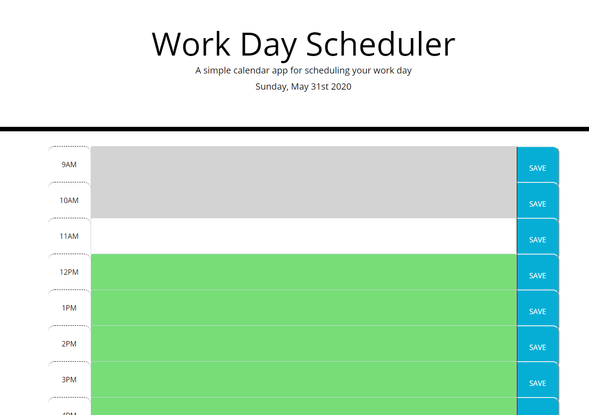
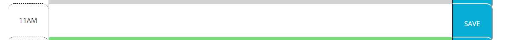
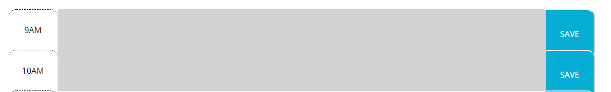
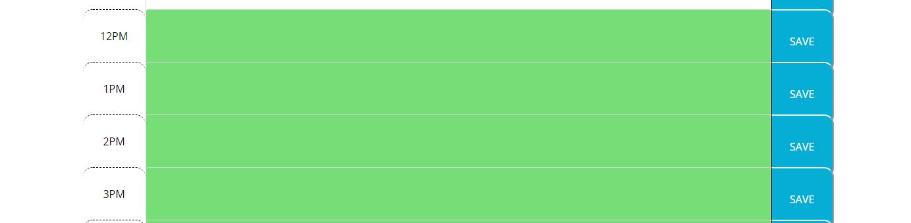

<header>Work Day Scheduler</header>

<h1>Summary</h1>
A modification of existing code for enhancement.   Below are screenshots of how to utilize the program. 

<body>

<h1>Link to deployed application:</h1> 
https://jeremyrice98.github.io/Work-Day-Scheduler/
</body>

<h1>How to use the program:</h1>

1. The front of the application

2. Present time frame of the application will appear in a white color so you know where you are.

3. Past time frame of the application will appear in a gray color so you know that the time is past and not needed.

4. Future time of the application will appear in a green color so you know that the time has not past. 
